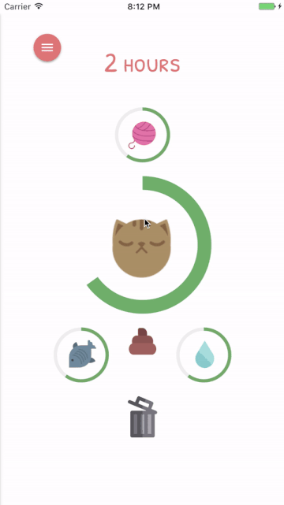

# Smiggles App

This the repository for the Smiggles Application.
Remember the [tamagotchis](https://en.wikipedia.org/wiki/Tamagotchi) of the 90s?  
The Smiggles app recreates this experience via Ruby on Rails where you can take care of a cat named Smiggles.  
Reading this you may think that Smiggles can only be played on the browser,   
but no, it can also be played on both iOS and Android as a downloadable app!

## How To Play
Smiggles only needs 4 things from a loving owner - its favourite yarn, some food and water, and someone to clean up it's icky mess.  
Be sure to drag these to their correct places - Smiggles knows what is food and what is his mess :wink:

Be sure to check in periodically. Smiggle won't last long without you.

Alternatively you can visit the [Smiggles site](https://smiggles-production.herokuapp.com/users/sign_in) to play straight away

## Prerequisites

- Ruby 2.3.3 
- Rails 5.1.1 
- PostgreSQL >= 9.6.1
- Heroku
- git version control

## Technical Overview
### How do Smiggle's attributes depreciate?
Heroku Scheduler sends request to Smiggle to start a background job. This background job is delayed to a certain time every hour depending on when Smiggle's life first started. ActionCable is used to instantly update Smiggle - you can see his attributes go down. ActionCable will also be used for a future version of Smiggle when multiple friends can take care of the same Smiggle.

### What happens when I drag food/yarn/water to Smiggle and waste to the trash bin?
An ajax request is fired and recieved by the Rails server. This sets into motion the many cogs and gears in the backend to update Smiggle's `boredom`, `hunger`, `thirst` and `waste` attributes. This is calculated to provide an amount to Smiggle's `life`. 

These are then sent via ActionCable to the app/browser and Smiggle's reaction and attribute bars are updated before the user's eyes! If this life is 0, Smiggles dies and the user needs to reset Smiggle. The time alive counter then resets.

## Future Plans
Smiggles is a work in progress. I intend to built many more features over time:

**Short Term**
- Registration and Session validation messages.
- Mailing system and set up SMTP for account verification during registration.
- Provide ability to log in via Facebook on iOS
- Allow user to view, edit and delete their profile.
- Test suite definitely needs to be implemented as a priority!
- The following tools to ensure for performance and integrity:
  - [Guard](https://github.com/guard/guard) to monitor for code smells
  - [SimpleCov](https://github.com/colszowka/simplecov) reports code coverage across the test suite.
  - [Bullet](https://github.com/flyerhzm/bullet) identifies N+1 queries and unused eager loading.
  - [Brakeman](https://github.com/presidentbeef/brakeman) static analysis security vulnerability scanner for Ruby on Rails.
  - [Bundler Audit](https://github.com/rubysec/bundler-audit) patch-level security verification for Bundler.
  - [Travis CI](https://travis-ci.org/) for continuous integration.
  
**Long Term**
- Scoreboard consisting of longest times you have kept Smiggle alive and happy
- Connect with your Facebook friends to take care of the same Smiggles.
- Other characters, such as Sir Quackers the duck

## Required Environment / Minimum Setup

\- [Ruby version](.ruby-version) 
\- [Rails version](Gemfile#L25)

Copy over `.env.example` and `config/database.example.yml` and edit to taste.

    $ git clone git@github.com:freddywong/smiggles.git
    $ cd smiggles
    $ bundle
    $ cp config/database.example.yml config/database.yml
    $ cp .env.example .env
    $ bin/rails db:setup

### Background Jobs

In order to run [Sidekiq](https://github.com/mperham/sidekiq) for background
job processing, you need to install [Redis](http://redis.io/).

If you are using OSX and you are using [Homebrew](http://brew.sh/), you can
install it by running:

    $ brew install redis

Then, in _separate terminals_, run the commands to boot up Sidekiq and Redis:

    $ bin/sidekiq
    $ redis-server

Running these will enable
[Sidekiq Cron](https://github.com/ondrejbartas/sidekiq-cron), which will
periodically queue jobs for background processing. 

You can also see the jobs that are scheduled, enqueued, processing, processed, dead and more at the [Sidekiq dashboard](http://localhost/sidekiq)

### Run Application

Run Rails server (Puma):

    $ bin/rails server

Run Rails console:

    $ bin/rails console

## Accessing the Site

- Development (Puma): http://localhost:3000
- Production (Heroku): https://smiggles-production.herokuapp.com/
- Staging (Heroku): TBD

## Configuration

If you need values for the configuration files (like values for `ENV` variables)
in the `.env` file, then:

- if you have access to the staging/production environments, you can look
  them up in Heroku's settings.

## Testing
Must absolutely, positively do tests for this!

The tests, as well as other quality control measures, will get run during CI.

## Staging Environment

Since this is a personal project, I have yet to set up staging, instead the production is used as staging for now. 

The staging site is located at: https://smiggles-production.herokuapp.com/

### Deployment

Add a git remote to the project:

    $ git remote add production git@github.com:freddywong/smiggles.git

Deploy to Heroku production environment
(assuming you want to deploy the `master` branch):

    $ git push production master

### SSHing

SSH on to staging server (and open up a `rails console`):

    $ heroku run rails console --app smiggle-production

## Production Environment

The production site located at: https://smiggles-production.herokuapp.com/

### Deployment

Add a git remote to the project:

    $ git remote add production git@github.com:freddywong/smiggles.git

Deploy to Heroku production environment
(assuming you want to deploy the `master` branch):

    $ git push production master

### SSHing

SSH on to staging server (and open up a `rails console`):

    $ heroku run rails console --app smiggle-production

## Known Issues / Gotchas

## Extended Resources
